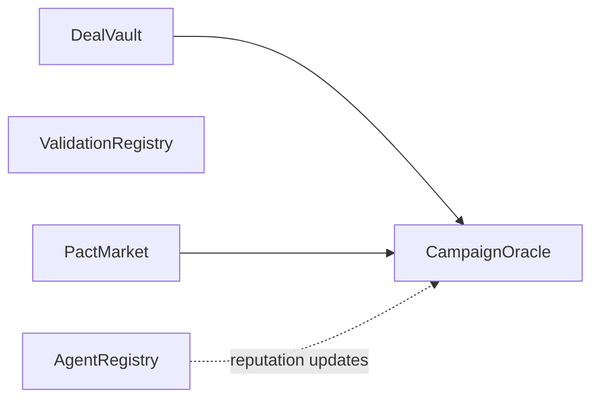

# Smart Contracts Architecture

Five Soroban contracts form the on-chain core. **All capital flows through DealVault.**

## Call Graph



## Contracts

| Contract | Role |
|----------|------|
| **AgentRegistry** | Creator/brand identity, verification, reputation tiers |
| **ValidationRegistry** | On-chain artifact logging (guidelines, deal intents) |
| **DealVault** | USDC escrow, stakes, lifecycle, settlement |
| **CampaignOracle** | Authorized metric results per deal |
| **PactMarket** | YES/NO prediction AMM tied to deals |

## Capital Rules

1. Never transfer USDC outside DealVault for deal flows.
2. `create_deal` requires auth from **both** creator and brand wallets.
3. Settlement reads oracle result from CampaignOracle.
4. PactMarket uses oracle outcome for market resolution.

## Build & Test

```bash
cd contracts
stellar contract build
cargo test
```

Per-crate docs: see each contract's `README.md`.

## Deployment

See [guides/deploy-testnet.md](../guides/deploy-testnet.md) and [operations/testnet-runbook.md](../operations/testnet-runbook.md).
