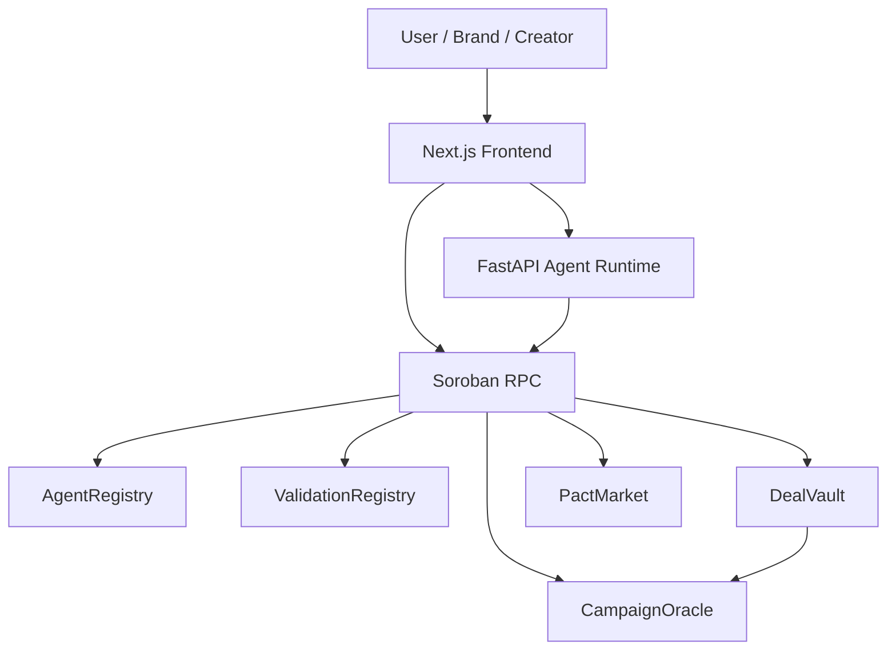
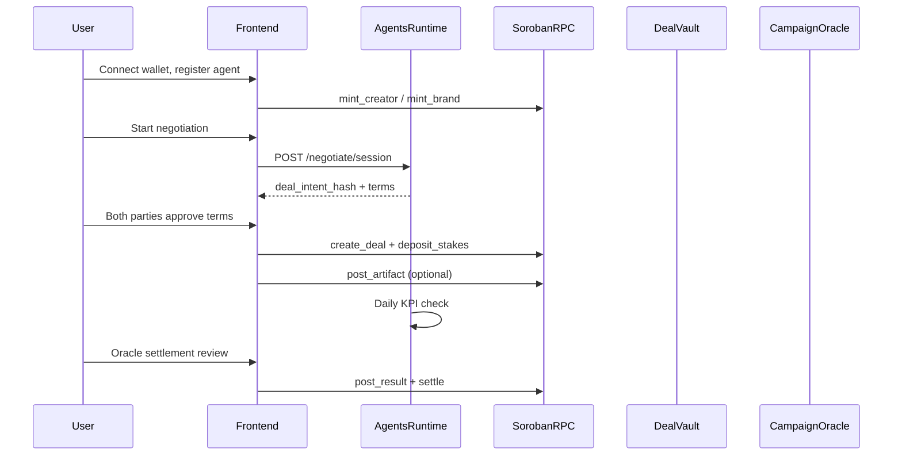

# System Overview

Pact Protocol Stellar connects three layers: **Soroban contracts** (capital + truth), a **Python agent runtime** (negotiation + oracle ops), and a **Next.js frontend** (wallet UX).

## High-Level Diagram

## End-to-End Deal Flow

## Trust Boundaries

| Layer | Trust model |
|-------|-------------|
| DealVault | Both parties sign; funds escrowed on-chain |
| CampaignOracle | Only authorized signer posts results |
| Agent runtime | Off-chain coordination; does not hold funds |
| Frontend | User wallet signs all capital txs |

## Configuration

Contract addresses: [ops/testnet/deployment-manifest.json](../../ops/testnet/deployment-manifest.json)

Environment template: [.env.example](../../.env.example)

## Related Docs

- [contracts.md](contracts.md)
- [agents-runtime.md](agents-runtime.md)
- [frontend.md](frontend.md)
